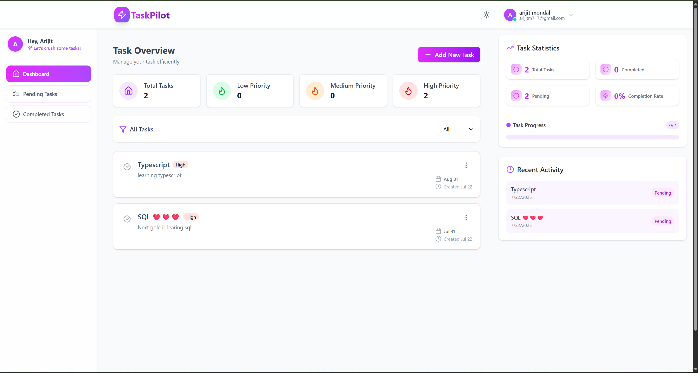

# 🚀 TaskPilot

**TaskPilot** is a powerful and intuitive task management app designed to help you organize, prioritize, and track your daily activities with ease. Whether you're managing personal to-dos, TaskPilot streamlines your workflow, boosts productivity, and ensures you never miss a deadline.

---

## 🌐 Live Demo

👉 [Check out the live app here](https://task-pilot-fawn.vercel.app)

---

## 🖼️ Screenshots

**Dashboard Page**  


---

## 📚 Tech Stack

**Frontend:**

- **React:** Builds a dynamic single-page application with reusable components and fast client-side routing.
- **Tailwind CSS:** Creates a responsive, modern UI using utility-first CSS classes.
- **Axios:** Makes HTTP requests to the backend API for authentication, profile updates, and messaging.

**Backend:**

- **Node.js:** Runs the server and handles asynchronous API requests.
- **Express.js:** Provides routing, middleware, and REST API endpoints for authentication, messaging, and file uploads.
- **Mongoose:** Manages MongoDB models and schema validation for users, messages, and profiles.
- **Cookie-Parser:** Parses cookies for storing JWT tokens securely on the client.
- **Bcryptjs:** Hashes passwords for secure user authentication.

**Database:**

- **MongoDB:** Stores user accounts, chat messages, and profile data in a flexible NoSQL database.

**State Management:**

- **Zustand:** Manages global state (like auth status, user data, and online users) simply and efficiently.

**Authentication:**

- **JWT:** Provides secure token-based authentication and protects private routes.

---

## 📁 Project Structure

```
TaskPilot/
│   ├── public/
│   ├── src/
│   │   ├── controllers/
│   │   ├── models/
│   │   ├── routes/
│   │   ├── middleware/
│   │   ├── utils/
│   │   └── index.js
│   ├── package.json
│   ├── .env
│   ├── .gitignore
│   ├── package-lock.json
│   └── README.md
├── frontend/
│   ├── public/
│   ├── src/
│   │   ├── components/
│   │   ├── constants/
│   │   ├── lib/
│   │   ├── pages/
│   │   ├── store/
│   │   ├── App.jsx
│   │   ├── index.css
│   │   └── main.jsx
│   ├── .gitignore
│   ├── index.html
│   ├── package.json
│   ├── vite.config.js
│   ├── README.md
├── README.md
```

## ⚙️ Installation

1️⃣ **1. Clone the Repository**

```bash
git clone https://github.com/your-username/TaskPilot.git
cd TaskPilot
```

2️⃣ **Install dependencies for frontend and backend**

```bash
# For backend
cd backend
npm install

# For frontend
cd ../frontend
npm install
```

3️⃣ **Add environment variables**

```bash
# Create a .env file in the backend directory and add:
PORT=4000
NODE_ENV=development
MONGODB_URI=
CLIENT_URL=
JWT_SECRET=
```

4️⃣ **Run the application**

```bash
# In backend
npm run dev

# In frontend
npm run dev
```

## 📬 Contact

Created by [Arijit Mondal](https://www.linkedin.com/in/arijit-mondal-211217287/) — feel free to reach out!
